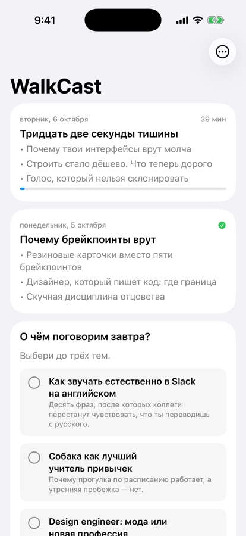
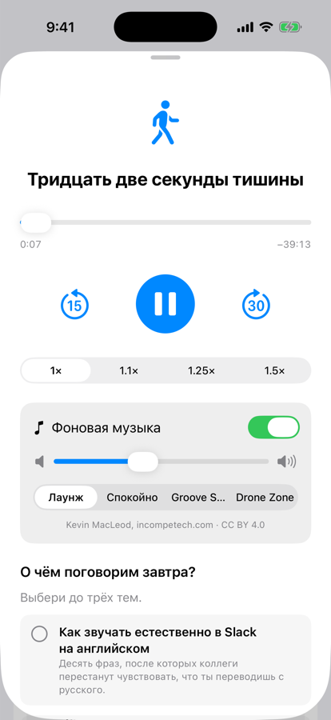

<p align="center"></p>

<h1 align="center">WalkCast</h1>

<p align="center"><b>A personal podcast for your evening walk, made by Claude from your own day.</b><br>
Every evening Claude reads what you worked on and thought about, writes a ~35-minute episode on three topics,
voices it and drops it on your phone. You put on headphones and take the dog out.<br>
<a href="https://dmitryvolostnov.github.io/walkcast/">Website</a> · <a href="README.ru.md">По-русски</a></p>

<p align="center"> &nbsp; </p>

## Install

You need a Mac, the [Claude desktop app](https://claude.ai/download) (or Claude Code) and an OpenAI API key for the voice. Paste this into Claude Code:

```
Set up WalkCast for me: clone https://github.com/DmitryVolostnov/walkcast into ~/WalkCast, then read ~/WalkCast/SETUP.md and follow it step by step.
```

Claude asks your name and a few things about you, checks the key, sets up the 19:00 schedule and plays you a voice sample. On the phone, use the iOS app (build from `app/` with Xcode) or the [web player](https://dmitryvolostnov.github.io/walkcast/player/) — no App Store yet.

## Why

Most of what I think about during the day happens in conversations with Claude: designs, code, half-formed ideas,
decisions made on the run. I never go back to them. A walk with the dog is the one quiet hour I have, and I
wanted that hour to be about *my* life, not a generic podcast. So Claude now does the going back for me.

I'm a product designer, and this started as a one-evening MVP. It's what I listen to every day, so I'm sharing it.
Feedback is welcome in [Issues](https://github.com/DmitryVolostnov/walkcast/issues).

## What an episode is like
- **Three topics, chosen fresh each day.** One usually picks up something you discussed in passing and adds what
  the conversation missed. The others come from a wide pool: career, craft, family, body, money, philosophy, history, something funny — or **the topics you picked** in the app the night before.
- **One clear idea per topic.** Written for the ear: no lists, context first, a single story told to the end.
- **A language on the side.** If you're learning one, each topic slips in a few phrases people actually use.
- **Humour, opinions, honest critique** of your own projects when it's earned.
- **Chapters and a chime** between topics; you can jump straight to any of them.

## The app
- Episodes as cards, progress remembered, playback speed, lock-screen controls.
- Chapters with timestamps.
- Background music under the voice: two built-in playlists or SomaFM radio, with volume and an off switch.
- **"What shall we talk about tomorrow?"** — six options under each episode; your picks go back to the Mac through iCloud.

## How it works
```
19:00  Claude scheduled task
       → pipeline/collect.py   digest of recent Claude Code sessions (+ your picks from the phone)
       → Claude writes the script by pipeline/PROMPT.md  → episodes/YYYY-MM-DD.md
       → pipeline/tts.py       OpenAI gpt-4o-mini-tts + chime between topics + chapters
                               → iCloud Drive/WalkCast/YYYY-MM-DD.mp3 + .json
evening  iPhone app (or web player) picks it up from iCloud Drive
```
Everything except the voice runs locally. Your sessions are read by Claude on your Mac; only the finished script
is sent to OpenAI for voicing. Cost: about $0.5 per episode for the voice, plus your Claude usage.

## Tweak it
| File | What |
|---|---|
| `pipeline/PROMPT.md` | The editorial brief: length, structure, tone, rules |
| `pipeline/topics.md` | The topic pool — add your own |
| `pipeline/state/notes.md` | Your wishes ("more sport", "less work"), read before every episode |
| `pipeline/config.json` | Name, languages, voice, sources |
| `pipeline/assets/stinger.mp3` | The chime between topics |

**Family radio.** `config.json` has a disabled second source. Point it at your partner's Claude logs or notes
(synced through iCloud) and the episode becomes one for two — shared topics only, nothing that reads like someone else's chat.

## Credits
Background music: Kevin MacLeod ([incompetech.com](https://incompetech.com)) — "Airport Lounge", "Backbay Lounge",
"Lobby Time", "Bossa Antigua", "Dreamer", "Meditation Impromptu 01", "Wallpaper". Licensed under
[Creative Commons: By Attribution 4.0](https://creativecommons.org/licenses/by/4.0/). Radio: [SomaFM](https://somafm.com), listener-supported.

## Status
An early MVP built for daily personal use. Episodes are Russian by default; other languages work through the
config but are less tested. MIT license.
